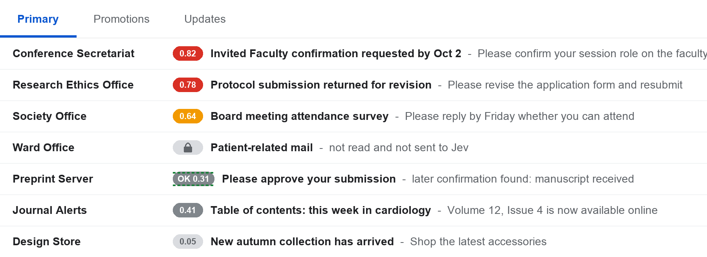

# Jev for Gmail

Gmail 받은편지함의 **기본(Primary) 탭** 메일 옆에 우선순위 점수 배지를 표시하는 크롬 확장 프로그램입니다.
점수는 [TypeSafe](https://typesafe.ai)의 **Jev** 모델이 매깁니다. Jev는 텍스트를 생성하지 않고, 정해진 질문에 확률과 점수로 답하는 모델입니다.

A Chrome extension that shows a priority score next to each email in Gmail's Primary inbox, using TypeSafe's Jev model. Gmail data is never modified.

예시 화면 (가짜 메일)

## 점수 계산

메일마다 Jev에게 네 가지를 묻습니다.

| 질문 | 형태 |
|---|---|
| 내가 직접 해야 할 일이 있는가 | 확률 0~1 |
| 얼마나 급한가 | 0~3 |
| 내 업무에 얼마나 중요한가 | 0~3 |
| 이미 회신했거나 처리했는가 | 확률 0~1 |

**우선순위 = 0.4 × 할 일 + 0.3 × 급함/3 + 0.3 × 중요도/3**. 이미 처리된 것으로 보이면 그만큼 감점합니다.

| 배지 | 의미 |
|---|---|
| 빨강 | 0.7 이상 |
| 주황 | 0.5 ~ 0.7 |
| 회색 | 0.3 ~ 0.5 |
| 연회색 | 0.3 미만 (광고, 뉴스레터 등) |
| 초록 점선 ✓ | 이미 처리된 것으로 판단 |
| 🔒 | 환자 관련 또는 민감 메일: 읽지 않고 전송하지 않음 |

배지에 마우스를 올리면 항목별 값이 보입니다.

## 개인정보와 안전

- **메일 본문이 TypeSafe 서버(미국)로 전송됩니다.** 사용 전 소속 기관의 개인정보 규정을 확인하세요.
- **환자 관련 메일은 전송하지 않습니다.** 발신자(설정에서 지정), 제목·미리보기 키워드(환자, 시술, 입원, 등록번호, 대상자, SAE 등), 8자리 번호·생년월일 패턴으로 걸러내며, 이런 메일은 본문도 가져오지 않습니다. 급여 명세서 같은 민감 메일도 제외합니다.
- 전송하는 메일도 전화번호, 생년월일, 주민번호, 7자리 이상 숫자는 가린 뒤 보냅니다.
- **필터는 완벽하지 않습니다.** 걸러지지 않은 메일에 개인정보가 남아 있을 수 있습니다.
- Gmail의 메일, 라벨, 읽음 상태는 바꾸지 않습니다. 화면에 배지만 추가합니다.
- API 키는 각자의 브라우저(`chrome.storage.local`)에만 저장됩니다.
- 이 도구는 의료기기나 임상 판단 도구가 아닙니다. 점수는 읽는 순서를 정하는 참고용입니다.

## 설치

1. 이 저장소에서 **Code → Download ZIP**을 눌러 받은 뒤 압축을 풉니다. 설치 후 폴더를 옮기거나 지우면 안 됩니다.
2. 크롬 주소창에 `chrome://extensions` 입력
3. 오른쪽 위 **개발자 모드** 켜기
4. **압축해제된 확장 프로그램 로드** → 압축을 푼 폴더(`manifest.json`이 있는 폴더) 선택
5. 자동으로 열리는 설정 화면에서 입력하고 저장 → **연결 테스트**
   - TypeSafe API 키 ([console.typesafe.ai/keys](https://console.typesafe.ai/keys)에서 발급)
   - 나에 대한 설명 (예: 홍길동, OO병원 순환기내과 교수, 임상연구자)
   - 내 이메일 주소
   - 환자 관련 메일 발신자 (시술 스케줄, 입원 명단 등을 보내는 주소, `@도메인` 형식 가능)
6. Gmail을 새로고침하면 받은편지함 기본 탭에 점수가 표시됩니다.

툴바 아이콘을 누르면 배지 켜기/끄기, 점수 캐시 지우기, 설정 열기를 할 수 있습니다.

## 동작 범위

- 받은편지함 **기본 탭**, **최근 7일** 메일만 채점합니다.
- 한 번 채점한 메일은 브라우저에 저장해 다시 보내지 않습니다 (새 답장이 오면 다시 채점).
- 비용: 메일 1통당 약 $0.0001 (각자의 TypeSafe 크레딧에서 차감).
- 본문은 Gmail 인쇄용 보기에서 가져오며, 읽음 상태는 바뀌지 않습니다.

## 파일

| 파일 | 역할 |
|---|---|
| `manifest.json` | 확장 설정 (Manifest V3) |
| `content.js` | Gmail 목록 읽기, 환자 메일 필터, 배지 표시 |
| `background.js` | Jev API 호출, 질문 정의 |
| `options.html/js` | API 키 등 설정 화면 |
| `popup.html/js` | 툴바 팝업 |

## License

MIT
